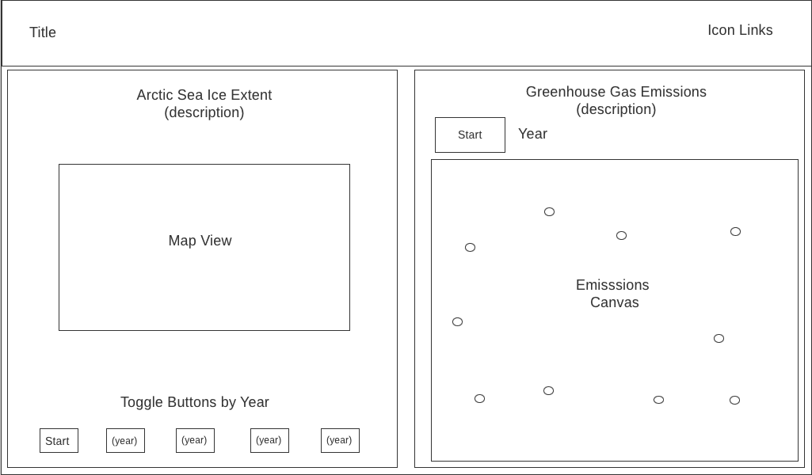
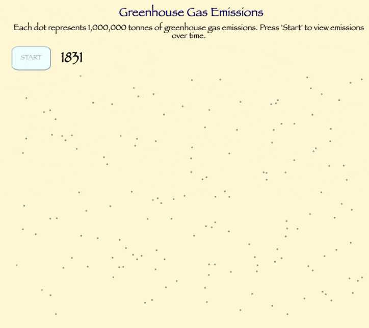

  

Climate Animator visualizes historical climate change data to emphasize the scale of climate impact to planet Earth. Users can use toggle buttons to view changes in arctic sea ice extent and greenhouse gas emissions over time.

Live Site: [Climate Animator](https://sodea1.github.io/climate_animator/)

* [Technologies Used](#technologies-used)
* [Wireframe](#wireframe)
* [Functionality](#functionality)
* [Implementation Timeline](#implementation-timeline)

## Technologies Used:

1. Node.js
2. D3.js
3. Canvas
4. HTML5
5. CSS

## Wireframe

## Functionality

1. Displays geographic arctic ice cap extent across four time periods.

2. User can toggle to view arctic ice extent by year.

3. User can 'Start' animation displaying each map chronologically.

4. User can 'Start' animation of greenhouse gas emissions over time.

### Arctic Ice Animation

### Greenhouse Gas Emissions Animation

## Implementation Timeline

1. Friday - Find reliable data sources
2. Saturday - Data conversions/formatting, d3 research
3. Sunday - arctic ice extent maps display
4. Monday - finalize maps & arctic ice animation
5. Tuesday - emissions animation
6. Wednesday - style, format & refactor

### Code for Map Animation
<pre><code>
  const renderRepeat = () => {
      const maps = [
          iceMap1980,
          iceMap1990,
          iceMap2003,
          iceMap2015
      ];
      
      let i = 0;
      let clearID = setInterval(() => {
          if (i === maps.length) {
              clearInterval(clearID);
              return;
          }
          document.querySelector("#map-box").remove();
          renderMap(maps[i]);
          i++;
      }, 750);
  };
</code></pre>
